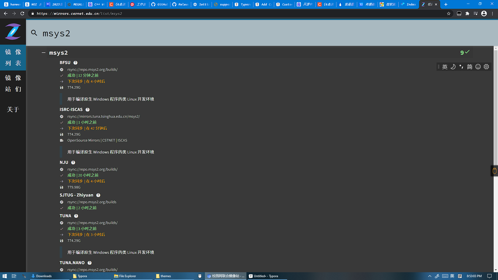
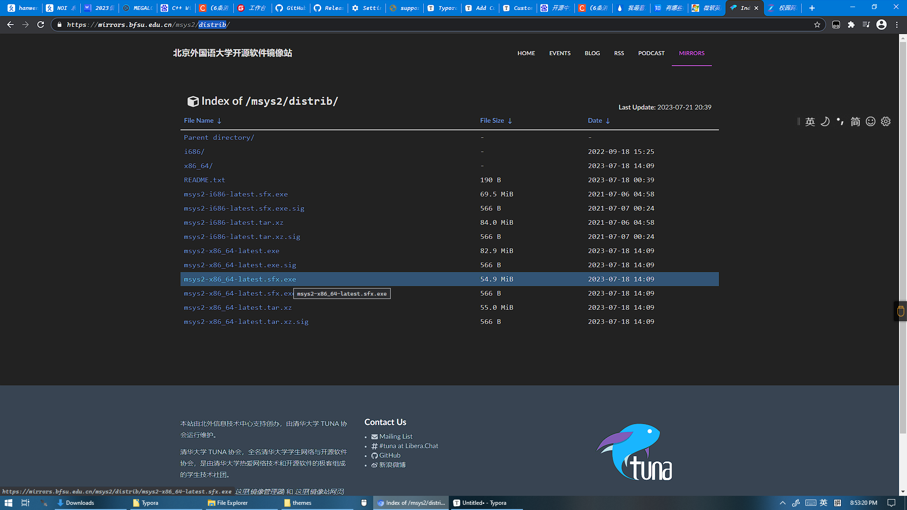
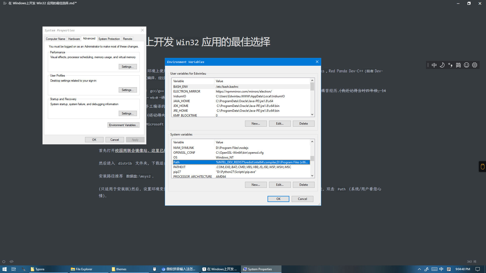
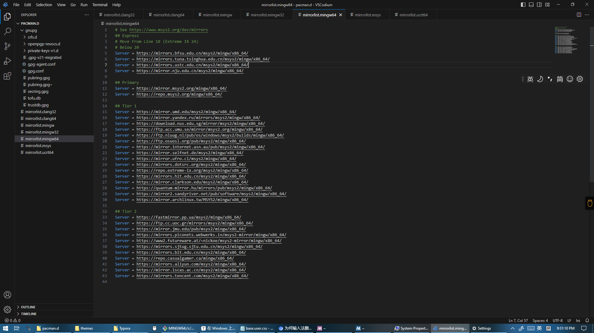
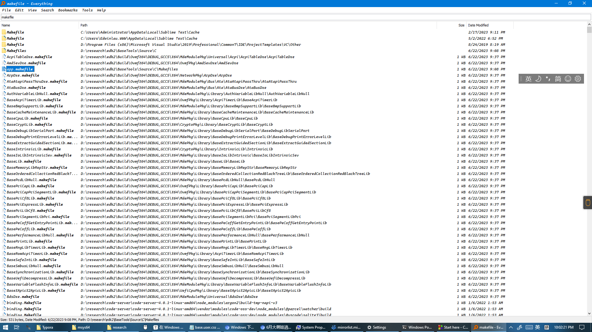
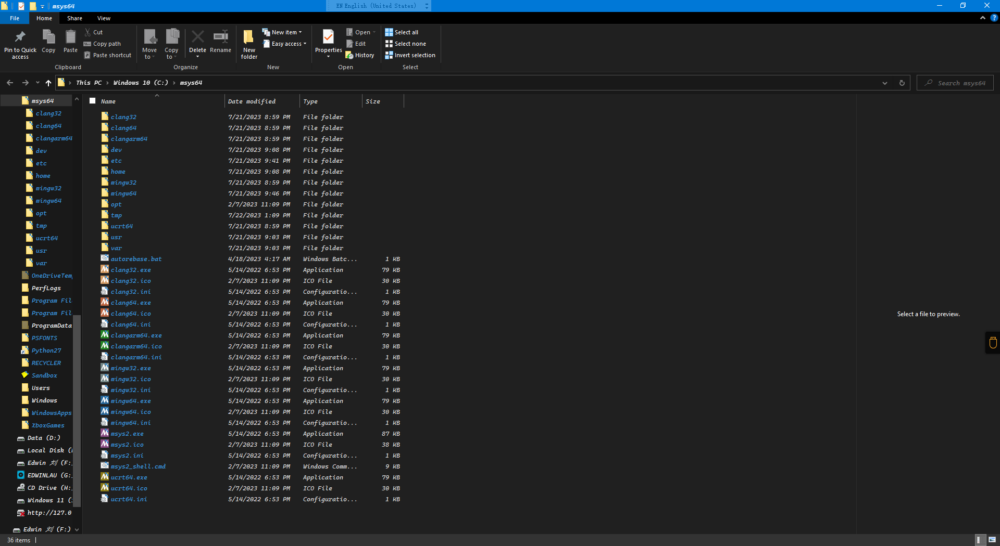
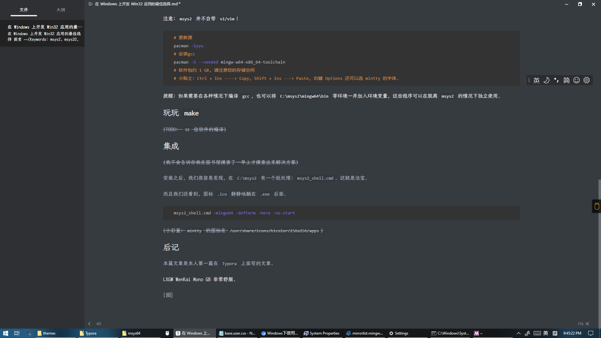

# MSYS2: 在 `Windows` 上开发 `Win32` 应用

## 前言

### 编者按

~~(Keywords: `msys2, msys32, win32, windows`)~~

目前为止, 我在 `Windows` 环境上使用过 `4` 种开发 `Win32` 软件的环境, 分别是: `Dev-C++`( `OI` 附送好吧), `Code::Blocks`, `Red Panda Dev-C++`(前者 `Dev-C++` 的变种)以及 make + 手工编译. 经过一番研究, 我发现手工编译反而是最省心的, 理由如下:

1. 我使用的是 `msys2` 的 `gcc/g++` , 非常稳定, 不会出现以前 `Dev-C++` 一个软件, 一天开一个新项目, 一天一个版本的痛苦经历.~~(我还记得当时四年级, 14天把一个文本编辑器从 `v1.0` 送到了 `v14.0`)~~
2. `make` 编译, 避免了手工编译的麻烦, 与 `Linux` 的 `GNU` 工具链相吻合. 
3. 使用 `Vim` , 轻量化. ~~(还记得大家用 `Dev-C++ / Code::Blocks` 三天一次 `OOM` 吗)~~
4. 环境齐全, 跟进微软 `Microsoft` 最新的 `Win32 API` 库. 
5. 手写 `.rc`, 避免格式各种不兼容. 
6. 软件干净, 静态编译后基本无依赖. 

### 小贴士 

1. 为了能够更快速地浏览到本文的图, 您可以使用镜像站打开本博客. 

2. 有人可能知道 `Git Bash` 使用的便是 `msys2` 的魔改版, 但那个版本不带有 `pacman`, 没有 `gcc/g++`, 但有 `Vim` (因为要 `git commit`), 不作推荐

## 安装

首先打开[校园网联合镜像站, 这里已经选好msys2, 您只需要选择离您地理位置最近的即可](https://mirrors.cernet.edu.cn/list/msys2), 以便加速下载. 



然后进入 `distrib` 文件夹, 下载适合您的版本. 其中 `*.sfx.exe` 为绿色版, `*.exe` 为安装版. 



安装路径推荐 `数据盘:\msys2` 或  `数据盘:\msys64`. 

(只适用于安装版)然后, 设置环境变量. 以各种方式运行 `C:\Windows\system32\SystemPropertiesAdvanced.exe`, 点环境变量, 双击 `Path` (系统/用户看您心情). 若是 `Windows 7 ~ 8`, 手动输入`;C:\msys2`, 否则直接使用图形化界面添加安装目录. 



前面只是为了安装 `msys2` 这个兼容层, 下面进入重头戏. 

先打开一个 `msys2` 终端, 最好是 `mingw64` 环境, 初始化并找找感觉.   

**(各个终端其实很多数据都是互通的)**

如果是国内环境, 别忘了调整镜像源. 

依次调整 `/etc/pacman.d/msys.mirrorlist, /etc/pacman.d/clang32.mirrorlist, /etc/pacman.d/clang64.mirrorlist, /etc/pacman.d/mingw.mirrorlist, /etc/pacman.d/mingw32.mirrorlist, /etc/pacman.d/mingw64.mirrorlist,/etc/pacman.d/ucrt64.mirrorlist` 五个文件, 将您认为较快且安全的镜像站调至前方并加入适量注释。

<!--[图]-->



**注意: `msys2` 并不自带 `vi/vim`! **

<!-- [图 from Windows 11] -->


```bash
# 更新源
pacman -Syyu 
# 安装 Vim, 体积非常小, 可选但推荐
pacman -S vim
# 安装 gcc
pacman -S --needed mingw-w64-x86_64-toolchain
# 软件包约 1 GB, 请注意您的存储空间
# 45 个包, 请静待花开. 
# 小贴士: Ctrl + Ins ----> Copy, Shift + Ins ---> Paste, 右键 Options 还可以选 mintty 的字体.  
```

**提醒: 如果需要在各种情况下编译 `gcc`, 也可以将 `C:\msys2\mingw64\bin` 等环境一并加入环境变量, 这些程序可以在脱离 `msys2` 的情况下独立使用. **

## 实验: 使用 `gcc` 编译含依赖库的软件

## 实验: 自行编译基于 `Win32` 子系统的软件

小提示: 如果您对 `Win32` 编程仍很陌生, 可以移步微软的官方教程: [Microsoft Learn: C/C++ Win32 编程入门](https://learn.microsoft.com/zh-cn/windows/win32/learnwin32/). 

### 在对话框下玩玩 `Hello world`

```cpp
#include <windows.h>
int WINAPI WinMain(HINSTANCE hInstance, 
                   HINSTANCE hPrevInstance, 
                   LPTSTR    lpCmd, 
                   int       nCmdShow) {
    MessageBoxA(0, "Hello world", "Prompt", MB_INFORMATION);
    return 0;
}
```

```bash
# MINGW64
g++ 1.cpp -luser32 -mwindows -static-libgcc -static-libg++ -o 1.exe
./1.exe
```

您应当能在屏幕中央看到 `Hello world` 的提示字样. 

### 使用资源文件创建菜单栏, 对话框, 图标, 图片

参考资料: https://zhuanlan.zhihu.com/p/161343829

```bash
windres -J rc -O COFF source.rc target.res # 只有 COFF 是与 g++ 兼容的... 
g++ -c main.cpp -o main.o 
g++ target.res main.o -o final.exe
```

```cpp
//2.h
//两个资源文件的宏
#define IDB_BITMAP1 1001
#define IDI_ICON    1002
//2.cpp 
#include <cstdio>
#include <cstring>
#include <windows.h>
#include "2.h"
HBITMAP hBitmap;
HINSTANCE g_Inst;
char title_buffer[2048];
LRESULT CALLBACK WndProc(HWND hwnd, UINT uMsg, WPARAM wParam, LPARAM lParam) {
	switch (uMsg) {
		case WM_CREATE: {
			hBitmap = LoadBitmapA(g_Inst, MAKEINTRESOURCEA(IDB_BITMAP1));
			break;
		}
		case WM_PAINT: {
			PAINTSTRUCT ps;
			HDC hdc = BeginPaint(hwnd, &ps);
			HDC hMemDC = CreateCompatibleDC(hdc);
			SelectObject(hMemDC, hBitmap);
			RECT rect;
			GetClientRect(hwnd, &rect);
			sprintf(title_buffer, "[My First Window] L: %d\tR: %d\tT: %d\tB: %d", rect.left, rect.right, rect.top, rect.bottom);
			SetWindowTextA(hwnd, title_buffer);
			BitBlt(hdc, 0, 0, rect.right - rect.left, rect.bottom - rect.top, hMemDC, 0, 0, SRCCOPY);
			DeleteDC(hMemDC);
			EndPaint(hwnd, &ps);
			return true;
		}
		case WM_DESTROY: {
			PostQuitMessage(0);
			break;
		}
		default: {
			return DefWindowProcA(hwnd, uMsg, wParam, lParam);
		}
	}
	return 0;
}
const char ClassName[] = "fulltest";
const char title[] = "My First Window";
int WINAPI WinMain(HINSTANCE hInstance,
	HINSTANCE hPrevInstance,
	LPTSTR    lpCmd,
	int       nCmdShow) {
	do {
		//Initialize
		g_Inst = hInstance;

	} while (0);
	WNDCLASSEXA wc;
	memset(&wc, 0, sizeof(wc));
	wc.cbSize = sizeof(WNDCLASSEXA);
	wc.lpfnWndProc = WndProc; /* This is where we will send messages to */
	wc.hInstance = hInstance;
	wc.hCursor = LoadCursor(NULL, IDC_ARROW);
	wc.hIcon = LoadIcon(NULL, MAKEINTRESOURCEA(IDI_ICON)); /* Load a standard icon */
	wc.hIconSm = LoadIcon(NULL, MAKEINTRESOURCEA(IDI_ICON)); /* use the name "A" to use the project icon */

	/* White, COLOR_WINDOW is just a #define for a system color, try Ctrl+Clicking it */
	wc.hbrBackground = (HBRUSH)(COLOR_WINDOW + 1);
	wc.lpszClassName = ClassName;
	if (!RegisterClassExA(&wc)) return 0;
	HWND hwnd = CreateWindowExA(WS_EX_CLIENTEDGE, ClassName, title, WS_OVERLAPPEDWINDOW | WS_VISIBLE, CW_USEDEFAULT, CW_USEDEFAULT, 640, 480, NULL, NULL, hInstance, NULL);
	if (hwnd == 0) {
		MessageBoxA(0, "Failed To Create An Window", 0, 0);
		return 0;
	}
	ShowWindow(hwnd, SW_SHOW);
	UpdateWindow(hwnd);
	MSG msg;
	while (GetMessage(&msg, NULL, 0, 0))
	{
		TranslateMessage(&msg);
		DispatchMessage(&msg);
	}
	return msg.wParam;
}

```

```shell
///2.rc
///请准备好 2.bmp 和 2.ico
#include "2.h"
IDB_BITMAP1 BITMAP "2.bmp"
IDI_ICON ICON "2.ico"
//其中好玩的是, 当.rc文件需要嵌套时, 可以使用BEGIN/END 或者 {}
```


## 进阶: 玩玩 `make` 

~~(TODO:  `32` 位软件的编译)~~

`make` 是发源于 `Linux` 的源码编译工具, 用于无脑编译. 

我们将稍微讲一下 `makefile` 文件的规则, 然后 `Talk is cheap, show me your code.` 



### Dev-C++ Style

```makefile
# Project: Light Convenient MCL
# Makefile created by Dev-C++ 6.7.5
CPP      = g++.exe -D__DEBUG__
CC       = gcc.exe -D__DEBUG__
WINDRES  = windres.exe
RES      = Light_Convenient_MCL_private.res
OBJ      = main.o $(RES)
LINKOBJ  = main.o $(RES)
LIBS     = -L"D:/Dev-Cpp-x86-64/Dev-Cpp/MinGW32/lib/gcc/i686-w64-mingw32/10.3.0/" -L"D:/Dev-Cpp-x86-64/Dev-Cpp/MinGW32/lib/gcc/" -L"D:/Dev-Cpp-x86-64/Dev-Cpp/MinGW32/i686-w64-mingw32/lib/" -L"D:/Dev-Cpp-x86-64/Dev-Cpp/MinGW32/lib/" -L"D:/Dev-Cpp-x86-64/Dev-Cpp/MinGW32/lib" -L"D:/Dev-Cpp-x86-64/Dev-Cpp/MinGW32/i686-w64-mingw32/lib" -g3 -L"E:/Project/Light_Convenient_MCL" -mwindows D:/Dev-Cpp-x86-64/Dev-Cpp/MinGW32/lib/gcc/i686-w64-mingw32/10.3.0/LIBCURL.LIB -static
INCS     = -I"D:/Dev-Cpp-x86-64/Dev-Cpp/MinGW32/lib/gcc/i686-w64-mingw32/10.3.0/include" -I"D:/Dev-Cpp-x86-64/Dev-Cpp/MinGW32/include" -I"D:/Dev-Cpp-x86-64/Dev-Cpp/MinGW32/lib/gcc/i686-w64-mingw32/10.3.0/include-fixed" -I"D:/Dev-Cpp-x86-64/Dev-Cpp/MinGW32/i686-w64-mingw32/include"
CXXINCS  = -I"D:/Dev-Cpp-x86-64/Dev-Cpp/MinGW32/include/c++/10.3.0" -I"D:/Dev-Cpp-x86-64/Dev-Cpp/MinGW32/include/c++/10.3.0/i686-w64-mingw32" -I"D:/Dev-Cpp-x86-64/Dev-Cpp/MinGW32/include/c++/10.3.0/backward" -I"D:/Dev-Cpp-x86-64/Dev-Cpp/MinGW32/lib/gcc/i686-w64-mingw32/10.3.0/include" -I"D:/Dev-Cpp-x86-64/Dev-Cpp/MinGW32/include" -I"D:/Dev-Cpp-x86-64/Dev-Cpp/MinGW32/lib/gcc/i686-w64-mingw32/10.3.0/include-fixed" -I"D:/Dev-Cpp-x86-64/Dev-Cpp/MinGW32/i686-w64-mingw32/include"
BIN      = Light-Convenient-MCL.exe
CXXFLAGS = $(CXXINCS) -Wall -Wextra -g3 -std=c++11
ENCODINGS = -finput-charset=utf-8 -fexec-charset=gbk
CFLAGS   = $(INCS) -Wall -Wextra -g3 -std=c11
RM       = del /q /f

.PHONY: all all-before all-after clean clean-custom

all: all-before $(BIN) all-after

clean: clean-custom
	${RM} $(OBJ) $(BIN)

$(BIN): $(OBJ)
	$(CPP) $(LINKOBJ) -o "$(BIN)" $(LIBS)

main.o: main.cpp rapidjson/allocators.h rapidjson/document.h rapidjson/encodedstream.h rapidjson/encodings.h rapidjson/error/error.h rapidjson/internal/biginteger.h rapidjson/internal/clzll.h rapidjson/internal/diyfp.h rapidjson/internal/dtoa.h rapidjson/internal/ieee754.h rapidjson/internal/itoa.h rapidjson/internal/meta.h rapidjson/internal/pow10.h rapidjson/internal/stack.h rapidjson/internal/strfunc.h rapidjson/internal/strtod.h rapidjson/internal/swap.h rapidjson/memorystream.h rapidjson/prettywriter.h rapidjson/rapidjson.h rapidjson/reader.h rapidjson/stream.h rapidjson/stringbuffer.h rapidjson/writer.h resource.h
	$(CPP) -c main.cpp -o main.o $(CXXFLAGS) 

Light_Convenient_MCL_private.res: Light_Convenient_MCL_private.rc resources.rc
	$(WINDRES) -i Light_Convenient_MCL_private.rc --input-format=rc -o Light_Convenient_MCL_private.res -O coff 

```

### Windows SDK Style **(from v7.1)**

```makefile
# Nmake macros for building Win32 & Win64 apps

!include <Win32.Mak>

all: $(OUTDIR) $(OUTDIR)\Cursor.Exe

$(OUTDIR) :
    if not exist "$(OUTDIR)/$(NULL)" mkdir $(OUTDIR)

# Update the resource if necessary

$(OUTDIR)\Cursor.Res: Cursor.Rc Cursor.h BullsEye.Cur
    $(rc) $(rcflags) $(rcvars) /fo $(OUTDIR)\cursor.res Cursor.Rc

# Update the object file if necessary

$(OUTDIR)\Cursor.Obj: Cursor.c Cursor.h
    $(cc) $(cflags) $(cvars) $(cdebug) /WX /Fo"$(OUTDIR)\\" /Fd"$(OUTDIR)\\" Cursor.c

# Update the executable file if necessary, and if so, add the resource back in.

$(OUTDIR)\Cursor.Exe: $(OUTDIR)\Cursor.Obj $(OUTDIR)\Cursor.Res Cursor.Def
    $(link) $(linkdebug) $(guiflags) -out:$(OUTDIR)\Cursor.Exe $(OUTDIR)\Cursor.Obj $(OUTDIR)\Cursor.Res $(guilibs)

clean:
        $(CLEANUP)

```

### edk2 style

```makefile
## @file
# Makefiles
#
# Copyright (c) 2007 - 2014, Intel Corporation. All rights reserved.<BR>
# SPDX-License-Identifier: BSD-2-Clause-Patent
#

MAKEROOT ?= ../..

include $(MAKEROOT)/Makefiles/header.makefile

APPLICATION = $(MAKEROOT)/bin/$(APPNAME)

.PHONY:all
all: $(MAKEROOT)/bin $(APPLICATION)

$(APPLICATION): $(OBJECTS)
	$(LINKER) -o $(APPLICATION) $(LDFLAGS) $(OBJECTS) -L$(MAKEROOT)/libs $(LIBS)

$(OBJECTS): $(MAKEROOT)/Include/Common/BuildVersion.h

include $(MAKEROOT)/Makefiles/footer.makefile

```

可见它们都是由变量(可略去), 命令两部分组成. 其中命令可以使用@避免输出, 跟 `Windows Command Processor` 有相似之处. 

所以用不用, 怎么写, 看你的了!

## 集成到终端

~~(我不会告诉你我在图书馆摸索了一早上才摸索出来解决方案)~~

安装之后, 我们很容易发现, 在 `C:\msys2` 有一个批处理: `msys2_shell.cmd`. 这就是法宝. 

而且我们还看到, 图标 `.ico` 静静地躺在 `.exe` 后面. 

<!-- [图] -->



```bash
msys2_shell.cmd -mingw64 -defterm -here -no-start
```

~~(小彩蛋: `mintty` 的图标在 `/usr/share/icons/hicolor/256x256/apps`)~~

<!-- [配置完成动图/视频] -->

## 后记

本篇文章是本人第一篇在 `Typora` 上面写的文章. 

~~(我用的是破解版, 小朋友们不要学我)~~

~~**但是因为没有正确配置, 我的那么多图丢啦!!!!!**~~

图片已经补全, 可以顺利浏览. 

**LXGW WenKai Mono GB 非常舒服, 不足也很明显, 有点扁. ** 

<!-- [图] -->


